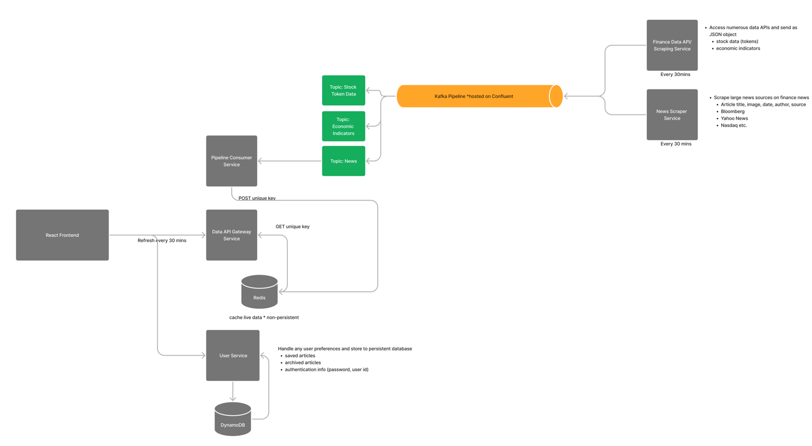

# Stockify - Real-Time Stock Dashboard

Stockify is a real-time stock dashboard application that provides users with up-to-date stock data and related news articles. The application is built using Golang for the backend, React for the frontend with Material styling, and utilizes a Kafka pipeline hosted on Confluent for efficient data processing. Deployments are orchestrated with AWS, Kubernetes, and Docker.

## Table of Contents

- [Features](#features)
- [Architecture](#architecture)
- [Usage](#usage)
- [Contributing](#contributing)
- [License](#license)

## Features

- Real-time stock data display
- News articles related to stock tickers
- Golang backend microservices
- Kafka pipeline for data processing
- Redis caching for improved data retrieval
- React frontend with Material styling
- Deployment using AWS, Kubernetes, and Docker

## Architecture

The Stockify application is composed of multiple microservices orchestrated in a Kubernetes cluster. The architecture includes:

- **Backend Microservices:**
  - Golang microservices for colly data scraping, Kafka interaction, and Redis caching.
  - Kafka producers for stock ticker data and news articles.
  - Kafka consumer microservice that retrieves data from Kafka and posts it to Redis cache.

- **Frontend:**
  - React application for the user interface.
  - Material styling for a clean and responsive design.

- **Pipeline:**
  - Kafka pipeline hosted on Confluent for efficient data processing.

- **Deployment:**
  - AWS for cloud infrastructure.
  - Kubernetes for container orchestration.
  - Docker for containerization.

## Usage

1. Access the Stockify dashboard via the provided URL.

2. Explore real-time stock data and related news articles.

3. Interact with the clean and responsive user interface.

## Contributing

Feel free to contribute to Stockify by opening issues, providing feedback, or submitting pull requests. Your contributions are highly appreciated!

## License

Stockify is licensed under the [MIT License](LICENSE).

---

**Happy Stockifying!** 🚀
